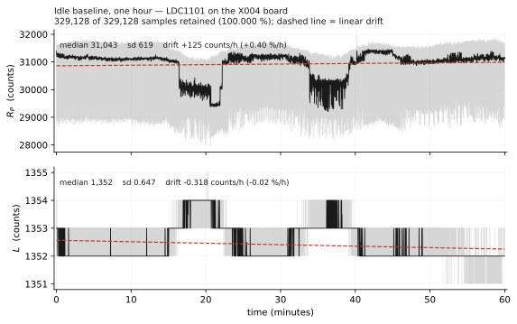

# DATA — measured captures and figures

Waveforms and figures from the bring-up and characterization work. Everything here
is measured on the X004 prototype board unless a file says otherwise; nothing is
simulated except `ttcgs_golden.png`, which is the reference the RTL is checked
against.

## Figures

| File | Shows |
|---|---|
| `ttcgs_golden.png` | golden-model reference output — the bit-exact fixed-point model the RTL regression compares against |
| `ttcgs_ADS_A.png` | piezoresistive channel, corner A, via the ADS114S08 divider |
| `ttcgs_tap_C.png` | tap transient on corner C — fast-adapting character |
| `ttcgs_MRE_rp.png` | LDC1101 RP channel responding to MRE compression |
| `ttcgs_poke_L.png` | LDC1101 L channel under a localized poke |

> **To be completed by the author.** Each figure needs its capture conditions
> recorded: date, bitstream, LDC register settings (`RP_SET`, `DIG_CONF`, CLKIN
> divider), loading method and contact area, and — for the inductive traces —
> whether the indenter was conductive. Without those, a trace cannot be compared
> against another session's, because the LDC baselines shift with register
> settings and with coil–skin geometry. The RP baseline in particular moves by
> nearly 2× between `RP_SET` 0x46 and 0x47 for identical physical conditions.

## Logic-analyser captures

`2026-08-07_ADS-SPI-DRDY_logic-analyser_raw.sr` — sigrok/PulseView format, 2.500 s
at 4 MHz, 8-channel fx2lafw. This is the capture that settled the ADS sample-rate
question; it is read and interpreted in
[`CODE/V1/SAMPLE_RATE.md`](../CODE/V1/SAMPLE_RATE.md).

| LA channel | Signal | FPGA pin |
|---|---|---|
| D0 | `ads_drdy_n` | 51 |
| D1 | `ads_cs_n` | 53 |
| D2 | `ads_sclk` | 57 |
| D3 | `ads_din` | 68 |
| D4 | `ads_dout` | 69 |

The five signals are **mirrored** onto spare pins by `top_dual.v`'s `dbg_*`
outputs, so the probes did not have to contest header holes with the sensor
harness. Bitstream `dual_dbgmirror.fs`: `TIME_MUX = 0`, `STREAM_MODE = 0`,
`CLK_DIV = 56`. The LA's ground went to the ADS board's second GND pin — the same
net as the FPGA ground, but a shorter return than reaching across to the Tang
Nano's single GND.

> 4 MHz is only ~8 samples per SCLK period and is marginal: CS edges and clock
> edges land on the same sample often enough to shift byte framing by one bit.
> That is survivable when cross-checked against the RTL's `total_bits`, but
> **capture at 24 MHz next time** and the ambiguity disappears.

## Capture conventions

Raw captures follow `YYYY-MM-DD_<topic>_raw.csv`, one row per synchronized sample
set, written by [`CODE/V1/05_host_tools/log_dual.py`](../CODE/V1/05_host_tools/log_dual.py):

```
t_s, ch0..ch3, rp, l, rp_hex, l_hex, bad_ads, status, no_osc, chip_id, mark
```

| Column | Meaning |
|---|---|
| `ch0`–`ch3` | ADS114S08 channels, 16-bit signed |
| `rp`, `l` | LDC1101 equivalent parallel resistance and inductance, raw counts |
| `bad_ads` | a channel hit the rail this sample |
| `status` | LDC `STATUS` (0x20), sticky since the previous status line |
| `no_osc` | `NO_SENSOR_OSC` bit was set |
| `chip_id` | LDC `CHIP_ID` (0x3F), **re-read every sample loop** |
| `mark` | operator event label, typed during capture |

## Converting ADS counts to sensor resistance

The excitation and the reference are the same, so the divider is **ratiometric**
and the full-scale count is the converter's own:

```
    R_sensor = 100 kΩ × (32767 / counts − 1)
```

Verified against a soldered resistor on the X004 board, 2026-08-16 — 30 s, 2741
samples after discarding the logger's start-up rows:

```
1 MΩ   ->  3002 counts  ->  991.5 kΩ      0.85% error, sd 0.40 kΩ (0.040%)
100 kΩ ->  16652 counts ->   96.7 kΩ      within the resistors' own tolerance
```

Reference drift cancels in a ratiometric divider, which is why the two known
values land inside 1% without any trimming.

**Discard the first ~90 rows of any capture.** The logger's opening rows carry a
start-up transient — in the run above they held all 91 of the corrupted samples,
contiguous from row 0, on channels that were otherwise clean for the remaining
29.8 s.

> **Do not calibrate from a majority population without checking it.** A
> two-point fit taken earlier the same day gave `R_div = 98.1 kΩ` and a
> full-scale of **16 814**, and both points reproduced to 0.1% — because both
> points came from the *corrupted* half of the data (see below). The tell was
> there and was missed: a fitted full-scale of 16 814 implies the divider can
> never reach the converter's range, and the alternative fit gave 33 655, which
> **exceeds 16-bit full scale and is therefore impossible**. An impossible fitted
> constant means the input data is wrong, not the model.

## A one-bit shift that halved 27% of samples

Before the fix, captures held two populations exactly a factor of two apart —
1502 alongside 3004, 8326 alongside 16652 — covering 1.7% to 27.5% of samples
depending on the run. An exact factor of two is not an analog effect.

The driver clocks 17 bits for a 16-bit read and takes `spi_rx[15:0]`. When the
sampling edge lands near the boundary, one data bit is lost and the captured word
is **halved**. `RD_DELAY` in `ads114s08_spi.v` — about 1 µs between the DRDY edge
and the first clock — moves the sampling instant away from that boundary. It cut
the corruption from 27.5% to **0.04%** (1 sample in 2833).

**Every capture taken before 2026-08-16 is affected**, and the corrupted samples
are the *low* ones, not the high ones. To screen an old capture:

```python
med = np.median(v)                       # assumes the majority is correct —
v = np.where(np.abs(v*2 - med) < np.abs(v - med), v*2, v)
```

A halved reading of a near-shorted input still clips at 32 767 after doubling,
which is what produced the `0x7FFx` clusters that were repeatedly misread as
sensor saturation.

**Regression test:** a soldered 1 MΩ from the excitation pad to an AIN pad must
give a single population at ~3002 counts with nothing near 1502.

## Do not trust a pressure contact on the sensor pads

Four different pressure arrangements were tried on the X004 sensor pads — tape,
crocodile clips, a C-clamp, and a C-clamp through alumina. With a known 100 kΩ
fitted, the chain read **30 counts**, implying **55 MΩ** in the path. A clean
metal-to-metal contact of that geometry should be milliohms; even a 7 µm-wide
line contact computes to 2.4 mΩ, so the eight-order gap can only be a dielectric
film — plausibly silicone that migrated out of the elastomer, or the board's own
organic surface finish.

Soldering the leads brought the same 100 kΩ to 8326 counts with **sd 0.58**,
matching the untouched channels exactly. **Solder, or use a connector. A
multimeter probe reads through the film because its tip pierces it; flat leads do
not.**

## Screening a capture before you analyse it

Three checks, in this order. Skipping them has repeatedly produced conclusions that
later turned out to be instrumentation artifacts.

1. **`chip_id` must be `D4`.** `FF` means the MISO line was floating — the LDC was
   off the SPI bus, and every other field in that row is meaningless. Note that
   `FF` also sets the `NO_SENSOR_OSC` bit, so a dead link masquerades as a stalled
   tank; `chip_id` is the only thing that tells them apart. A `00` is benign
   (a read that returned nothing) and does not invalidate the row.

2. **`no_osc` with a *valid* status** is a genuine tank stall. Exclude those rows;
   they are typically well under 1% and are flagged precisely so they can be
   dropped.

3. **Sanity-bound `l` and `rp`.** A healthy idle baseline has `l` standard
   deviation below ~1 count. If it is much larger, something is wrong upstream —
   check the link before interpreting the physics.

## Reference baseline

`2026-08-01`, LDC-only, sensor board on an isolated supply, one hour, 329128 samples:

```
valid samples   100.000%        CHIP_ID 0xFF: 0        tank stalls: 0
L  sd 0.647 counts (best 5-minute window 0.202)
RP sd 619 counts
drift   RP +122 counts/h (+0.39%/h)      L −0.37 counts/h (−0.027%/h)
```



Use this as the no-target reference when normalising other captures.

**The linear drift figures above are not the whole story, and taking them as such
will produce a false result.** RP leaves its baseline twice in this hour — at
16.6–22.2 min and 35.2–38.6 min — by **−1717 and −1888 counts (−5.5%, −6.1%)**,
in step-like excursions lasting two to four minutes. They are visible in the
figure and they are not noise: they are far larger than the sample-to-sample
standard deviation and they persist for minutes.

L barely notices the same events, moving +2 and +1 count while RP falls by
thousands. RP down with L slightly up is the signature of a small sensor-frequency
shift, but RP falls roughly eighteen times more than `RP ∝ f²` would account for,
so a loss change dominates. Whatever the cause, the two channels are affected
enormously differently.

### Which channel to use, by timescale

| | idle baseline | worst change within any 3-minute window | firm press | ratio |
|---|---:|---:|---:|---:|
| **RP** | 31094 | **2103** counts (6.76%) | ~5300 | **2.5×** |
| **L** | 1352 | **2.0** counts (0.15%) | ~35 | **17.5×** |

For **transient events** — taps, onsets, releases — RP is the better channel: its
response is large and the excursions above are far too slow to be mistaken for a
tap.

For anything held for **minutes** — creep, sustained load, slow relaxation — use
**L**. RP's own baseline wanders by 40% of a full press response on exactly the
timescale such a measurement occupies, which leaves no room to separate the
specimen from the instrument. L's absolute response is much smaller, but it is
quantisation-limited rather than wander-limited, and it wins by 7× on what
actually matters here.
